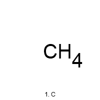
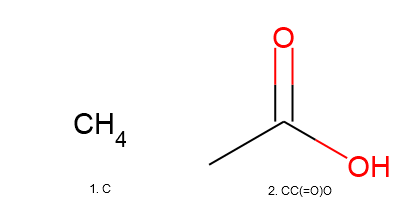
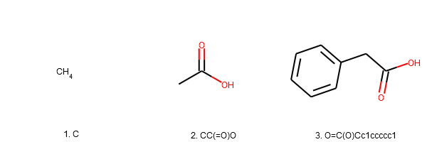
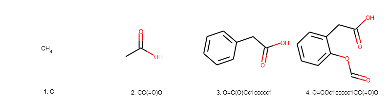
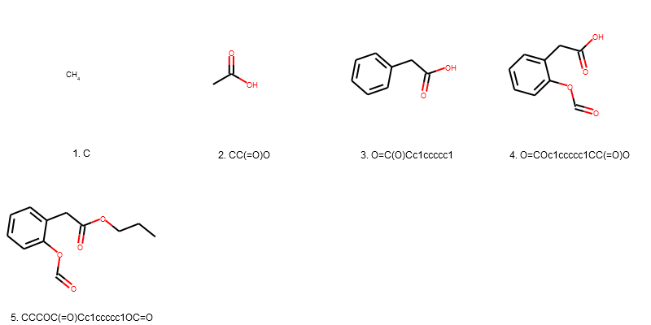
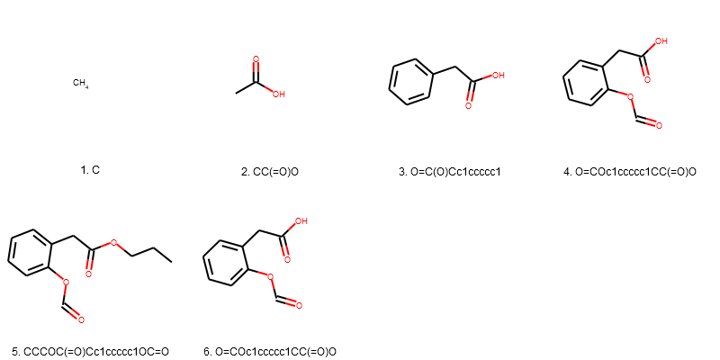
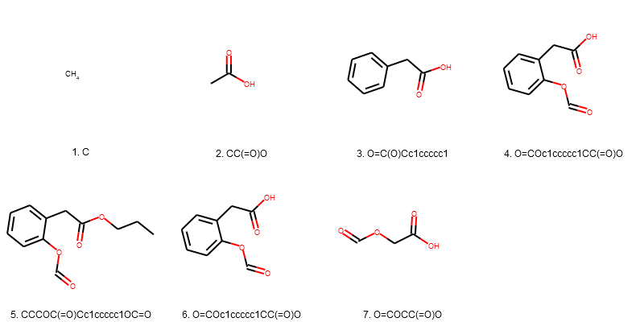
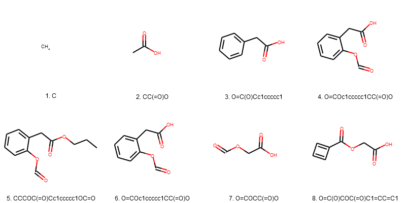

```
              _                 _      
  /\/\   ___ | | ___  ___ _   _| | ___ 
 /    \ / _ \| |/ _ \/ __| | | | |/ _ \
/ /\/\ \ (_) | |  __/ (__| |_| | |  __/
\/    \/\___/|_|\___|\___|\__,_|_|\___|
   __           _                                      _   
  /__\ ____   _(_)_ __ ___  _ __  _ __ ___   ___ _ __ | |_ 
 /_\| '_ \ \ / / | '__/ _ \| '_ \| '_ ` _ \ / _ \ '_ \| __|
//__| | | \ V /| | | | (_) | | | | | | | | |  __/ | | | |_ 
\__/|_| |_|\_/ |_|_|  \___/|_| |_|_| |_| |_|\___|_| |_|\__|

```                                                        


Reinforcement learning environment for inverse drug design.

The objective of the project was to create an environment which will allow the computer agent to make decisions/actions based on the state of the environment. In order to achieve this, open source packages such as OpenAI Gym, a popular framework for building bench marking environments for RL agents and RDkit which is a cheminformatics package used in computational chemistry.
This environment would be developed into an on going Msc project and integrated in future inverse design and drug discovery research.The approach to this task at hand is to create an environment which has 2 main functionalities which the agent can make use of. First it is environment step function which takes an action from the agent such “add” or “remove” an atom. This changes the current molecule and the action needs to be chemically valid.
Another function is to reset the environment by returning the current molecule to the initial molecule that had no changes implemented or change it to a single carbon atom.Other functions such as render will show the molecules current state of the environment.

## Set-up

Install dependencies:
```
conda env create -f environment.yml
```
Activate environment:
```
conda activate mol-env
```
# Molecule Envirnoment User Manual

### Imports


```python
from gym_molecule.envs.molecule_env import MoleculeEnvironment as MolEnv
from gym_molecule.envs.action import Action

```

### Initialising _molecule_env_


```python
my_env = MolEnv()
```

    

MoleculeEnvironment Initialises to a single carbon atom ('C')  we can display this by running render() method.


```python
my_env.render()
```





Create Action and call setAction method to specify the step you want to perform.


```python
action = Action()
action.setAction('Add',pos='back',mol='C(=O)O')
```

Call the step method with the action you want to perform as an argument


```python
my_env.step(action)
my_env.render()
```

    ['SingleAtomDonor' 'SingleAtomAcceptor' 'SingleAtomAcceptor' 'AcidicGroup']
    





The first positional argument specifies whether you want 'add' or 'remove' a feature. You can set the Atom / molecular substructure by setting the mol to a SMILES string  specify where you want to add the smile string by setting pos as 'front' or 'back'. 


```python
action.setAction('Add',pos='front',mol='C1=CC=CC=C1')
my_env.step(action)
my_env.render()
```





### Adding elements to a molecule

As seen below we using the arguments to specify action, position and substructur/atom to be added. In order to add we set 'add' in the first positional argument position.


```python
action.setAction('Add',pos='front',mol='C(=O)O')
my_obs = my_env.step(action)
my_env.render()
```

    ['SingleAtomDonor' 'SingleAtomAcceptor' 'SingleAtomAcceptor' 'AcidicGroup']
    





```python
action.setAction('Add',pos='back',mol='CCC')
my_obs = my_env.step(action)
my_env.render()
```

    ['ChainTwoWayAttach']
    





### Removing elements to a molecule

As seen below we using the arguments to specify action, position and substructur/atom to be added. In order to remove we set 'remove' in the first positional argument position.


```python
action.setAction('remove',pos='back',mol='CCC')
my_obs = my_env.step(action)
my_env.render()
```

    ['ChainTwoWayAttach']
    





#### Query remove

As seen below we using the arguments to specify action, position and substructur/atom to be added. In order to remove based on a specifc feature factor feature we set 'remove' in the first positional argument position and set query with a numpy array contain all the feature factory features you want to remove. The envirnoment will then remove the first feature the satisfys the features specified.


```python
import numpy as np
action.setAction('remove',query=np.array(['Arom6'])) 
my_env.step(action)
my_env.render() 
```





In the example above we were able to remove a 6 atom aromatic ring a list of base featueres can be found in the BaseFeature.fdef file on github

### Decision making 

In order to make an educated decision on the next a reinforcement learning computer agent needs to decide on the next step based on observations. This is information is collected by step method. 

#### Observations

The step method returns two observations firstly the morgan finger print the in a unique identifyer and also categorises each 'feature' in the molecule. The morgan finger print is stored as an array of 1028 bits.


```python
action.setAction('Add',pos='front',mol='C1=CC=C1') 
obs = my_env.step(action)
bits, info = obs.getInfo()
```
    


```python
print ('bits =' + str(bits))
print ('obs info =' + str (obs.getInfo()))
```

    bits =(array([ 80, 145, 147, 225, 283, 330, 345, 356, 389, 501, 547, 650, 684,
           695, 713, 788, 807, 849, 862, 891, 893, 973, 980], dtype=int64),)
    obs info =((array([ 80, 145, 147, 225, 283, 330, 345, 356, 389, 501, 547, 650, 684,
           695, 713, 788, 807, 849, 862, 891, 893, 973, 980], dtype=int64),)

### Rendering 

By running setting ui option to true you are able to render with an interactive UI set the positional argument true.


```python
my_env.render(True)
```





